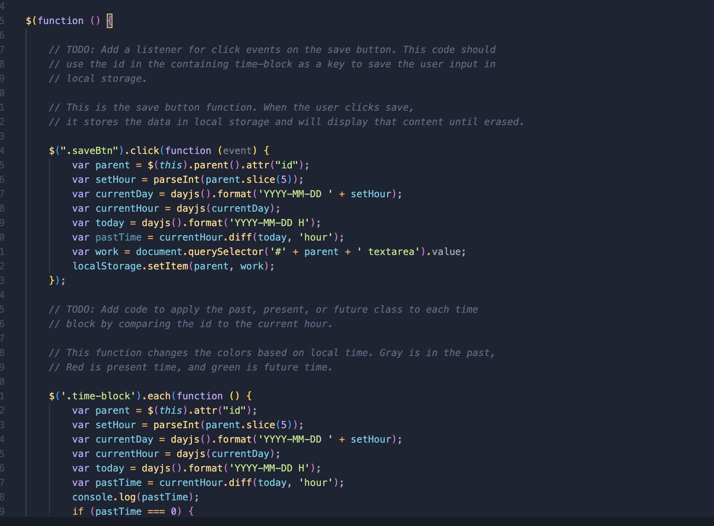
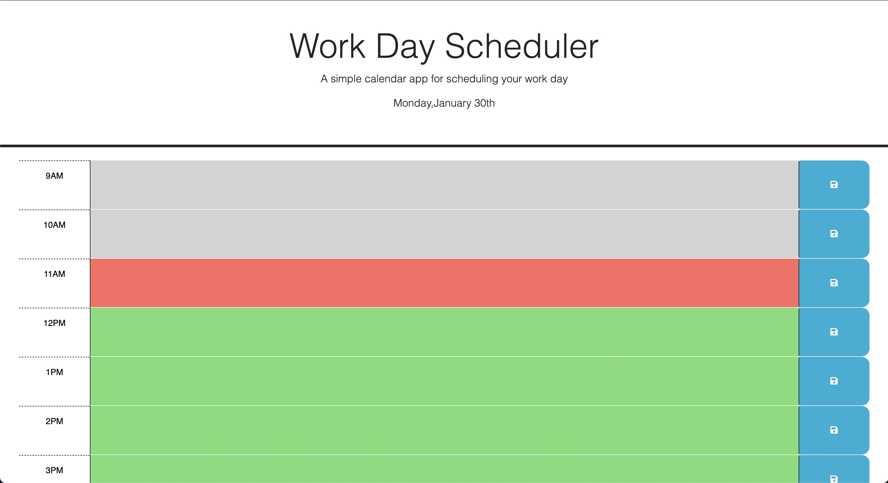

# Web API Quiz

 This Project was a blast to build. I used day.js to set the time zone (PT), and create a work day scheduler. By building this, I grew my knowledge of thrid-party API's and how to read documentation and implenent them into my code.

# Website Link

https://goobber33.github.io/Scheduling-Work-Day/

# Installation

Install the index.html, style.css, and jjscript.js and run it in your own IDE. 

# Usage

 A screenshot of some sections of code from my JavaScript for this project. 

Screenshots of the website. The website should resemble this screenshot when deployed.

# Credits

This project was built from using the code from the Github Repo cridpy-octo-meme by Georgeyoo and Kyle Parks